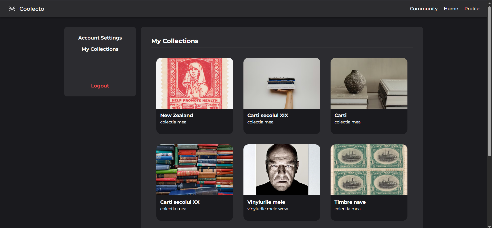
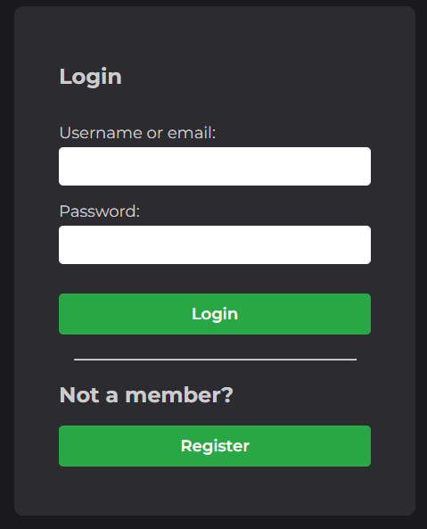
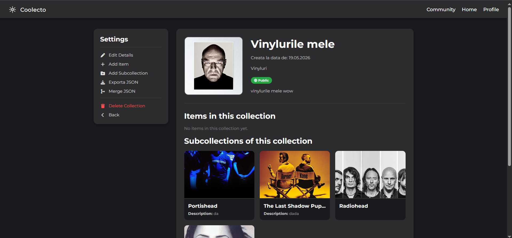
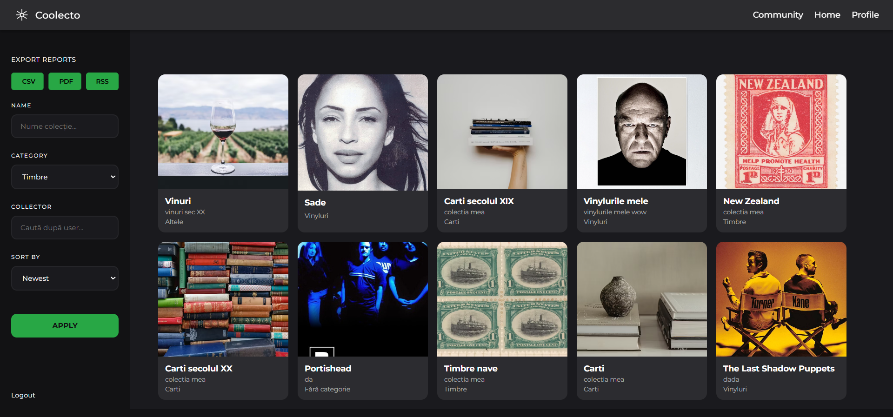
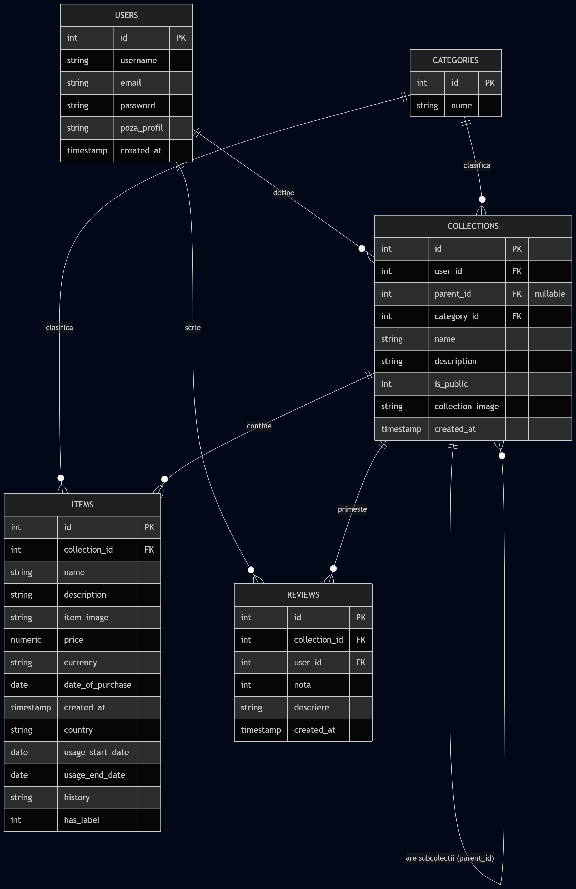

# IEEE-Tempate
IEEE System Requirements Specification Template

# Software Requirements Specification
## For  Object Collector on Web
Version 1.0 approved

Prepared by Panainte Tudor-Emanuel and Covalciuc Luca-Mihnea
<organization>

24-May-2026

Table of Contents
=================
  * [Revision History](#revision-history)
  * [Introduction](#1-introduction)
    * 1.1 [Purpose](#11-purpose)
    * 1.2 [Document Conventions](#12-document-conventions)
    * 1.3 [Intended Audience and Reading Suggestions](#13-intended-audience-and-reading-suggestions)
    * 1.4 [Product Scope](#14-product-scope)
    * 1.5 [References](#15-references)
  * [Overall Description](#overall-description)
    * 2.1 [Product Perspective](#21-product-perspective)
    * 2.2 [Product Functions](#22-product-functions)
    * 2.3 [User Classes and Characteristics](#23-user-classes-and-characteristics)
    * 2.4 [Operating Environment](#24-operating-environment)
    * 2.5 [Design and Implementation Constraints](#25-design-and-implementation-constraints)
    * 2.6 [User Documentation](#26-user-documentation)
    * 2.7 [Assumptions and Dependencies](#27-assumptions-and-dependencies)
  * [External Interface Requirements](#external-interface-requirements)
    * 3.1 [User Interfaces](#31-user-interfaces)
    * 3.2 [Hardware Interfaces](#32-hardware-interfaces)
    * 3.3 [Software Interfaces](#33-software-interfaces)
    * 3.4 [Communications Interfaces](#34-communications-interfaces)
  * [System Features](#system-features)
    * 4.1 [System Feature 1](#41-system-feature-1)
    * 4.2 [System Feature 2 (and so on)](#42-system-feature-2-and-so-on)
  * [Other Nonfunctional Requirements](#other-nonfunctional-requirements)
    * 5.1 [Performance Requirements](#51-performance-requirements)
    * 5.2 [Safety Requirements](#52-safety-requirements)
    * 5.3 [Security Requirements](#53-security-requirements)
    * 5.4 [Software Quality Attributes](#54-software-quality-attributes)
    * 5.5 [Business Rules](#55-business-rules)
  * [Other Requirements](#other-requirements)
* [Appendix A: Glossary](#appendix-a-glossary)
* [Appendix B: Analysis Models](#appendix-b-analysis-models)
* [Appendix C: To Be Determined List](#appendix-c-to-be-determined-list)

## Revision History
| Name | Date    | Reason For Changes  | Version   |
| ---- | ------- | ------------------- | --------- |
|      |         |                     |           |
|      |         |                     |           |
|      |         |                     |           |

## 1. Introduction
### 1.1 Purpose 
"Coolecto" este o platforma digitala creata pentru a ajuta utilizatorii sa isi gestioneze, organizeze si sa isi expuna colectiile personale de obiecte intr-un mod structurat si interactiv.

### 1.2 Document Conventions
Acest SRS respecta urmatoarele reguli de redactare:

- Documentul este scris in romana, fara diacritice, cu exceptia titlurilor care sunt in engleza.

### 1.3 Intended Audience and Reading Suggestions
Acest document este util pentru:

- Dezvoltatori: Pentru a avea clara structura aplicatiei, cerintele pentru baza de date si algoritmii necesari.

- Profesori Evaluatori: Pentru a intelege rapid functionalitatile implementate si efortul depus in proiect.

Recomandare de parcurgere: Evaluatorii pot citi Sectiunile 1 si 2 pentru o idee generala si Sectiunea 3 pentru a bifa functionalitatile proiectului. Dezvoltatorii trebuie sa citeasca tot, punand accent pe Sectiunea 3 si 4, care dicteaza logica tehnica a aplicatiei.

### 1.4 Product Scope
Scopul aplicatiei este de a oferi o solutie digitala "all-in-one" in care utilizatorii pot cataloga orice tip de obiect, pastrand o ierarhie clara in colectiile lor personale si avand posibilitatea de a arata munca lor lumii intregi.

Obiective si Beneficii majore:

- Organizare structurata: Crearea unui spatiu unde itemele sunt grupate logic in colectii si subcolectii.

- Independenta datelor: Prin sistemul avansat de Export/Import/Merge in format JSON, utilizatorii nu sunt blocati in platforma noastra. Isi pot salva arhiva offline oricand doresc.

- Interactiunea comunitatii: Sectiunea "Community" adauga valoare prin socializare. Pasionatii pot gasi inspiratie, pot da note si pot lasa recenzii la colectiile publice ale altor utilizatori.

### 1.5 References
Laborator Tehnologii Web, Oana Otilia Captarencu
- Sursa: https://profs.info.uaic.ro/oana.captarencu/tw/

Documentatia oficiala PHP - Baza tehnica pentru dezvoltarea backend-ului, a claselor OOP si a prelucrarii fisierelor JSON.
- Sursa: https://www.php.net/docs.php

## Overall Description
### 2.1 Product Perspective
Produsul "Coolecto" este o aplicatie web independenta, dezvoltata de la zero. Nu face parte dintr-o suita mai mare de produse si nu inlocuieste un sistem deja existent la nivel comercial, ci este o solutie originala creata pentru a satisface cerintele acestui proiect academic.

Functioneaza pe o arhitectura clasica client-server. Interfata grafica (HTML, CSS, JS) ruleaza pe dispozitivul utilizatorului, in timp ce logica este scrisa in PHP si ruleaza pe server, tinand datele intr-o baza de date PostgreSQL.

### 2.2 Product Functions
Functiile principale pe care aplicatia le ofera sunt impartite in doua mari zone:

1. Management Privat (Zona Dashboard):

- Creare cont si logare (pe baza de token-uri JWT).

- Crearea si gestionarea colectiilor (adaugare, editare, stergere).

- Crearea ierarhiilor (subcolectii infinite si iteme individuale cu detalii specifice).

- Incarcarea imaginilor cu sistem de protejare a stergerii (se sterg fizic doar cand nu mai sunt referentiate nicaieri).

- Export, Import si Merge de date folosind fisiere JSON.

2. Interactiunea Comunitatii (Zona Community):

- Vizualizarea colectiilor altor useri (doar cele marcate ca "Publice").

- Cautarea colectiilor dupa nume.

- Filtrarea dupa categorie si sortarea (cele mai noi, A-Z etc.).

- Sistem de recenzii si notare la colectiile vizitate.

### 2.3 User Classes and Characteristics
Avem doua clase simple de utilizatori pe platforma noastra:

- Vizitatori (Neautentificati): Pot accesa doar pagina de inregistrare/login. Nu pot vedea continutul platformei sau zona de Community pentru a pastra un nivel de baza de securitate si intimitate a datelor.

- Colectionari (Utilizatori inregistrati): Aceasta este clasa principala de useri. Presupunem ca au cunostinte tehnice de baza (stiu sa navigheze pe web si sa foloseasca o fereastra de upload). Ei au acces complet la propriul Dashboard si pot explora, cauta si interactiona prin recenzii in pagina de Community. Fiecare colectionar este considerat administratorul propriilor date.

### 2.4 Operating Environment
Aplicatia va rula intr-un mediu web standard, fiind foarte flexibila:

- Client (User): Orice browser web modern de pe un dispozitiv desktop.

- Server: Un server web capabil sa proceseze cod PHP si sa interactioneze cu o baza de date.

### 2.5 Design and Implementation Constraints
Limitarile tehnice de care a trebuit sa tinem cont sunt:

- Arhitectura impusa: Codul backend trebuie structurat folosind sabloanele MVC (Model-View-Controller) si DAO (Data Access Object) pentru operatiunile cu baza de date. Nu am amestecat query-urile SQL direct in HTML.

- Fara framework-uri: S-a folosit exclusiv "Vanilla PHP".

### 2.6 User Documentation
Platforma are un design minimalist, astfel ca interfata il ghideaza pe utilizator de la sine. Totusi am creat un videoclip de prezentare care il poate ajuta pe utilizator sa inteleaga cum se foloseste aplicatia.

### 2.7 Assumptions and Dependencies
Pentru ca proiectul sa ruleze fara erori, ne bazam pe cateva presupuneri externe:

- Permisiuni pe server: Presupunem ca mediul in care va rula aplicatia are permisiuni de scriere pe folderele de imagini. Altfel, upload-ul de fisiere va da fail.

- JavaScript: Utilizatorul are JavaScript activat in browser. JS-ul este crucial atat pentru requesturile din pagina de Community, cat si pentru declansarea automata a formularului de incarcare JSON.

- Librarii Externe: Depindem de un CDN extern pentru afisarea iconitelor (FontAwesome v6.4.0). Daca internetul pica sau CDN-ul este offline, iconitele vor lipsi de pe butoane, dar functionalitatea de baza nu va fi afectata.

## External Interface Requirements
### 3.1 User Interfaces
Interfata aplicatiei "Coolecto" este strict web-based, gandita sa fie curata si usor de folosit, adoptand un "Dark Mode" nativ.

- Design General: Aplicatia foloseste o bara de navigare (Navbar) consistenta pe toate paginile principale pentru acces rapid la Dashboard, Community si Profil.

- Zona de Actiuni (Sidebar): Pagina de vizualizare a unei colectii sau a unui item prezinta o bara laterala unde utilizatorul gaseste rapid actiunile posibile.

- Formulare (Input): Formularele de creare colectii/iteme sunt simple, actionate prin JavaScript.

- Mesaje de Sistem: Daca o colectie este goala, utilizatorul va primi un mesaj text simplu. Erorile de validare sau conexiune apar direct in interfata, fara pop-up-uri intruzive.

### 3.2 Hardware Interfaces
Deoarece "Coolecto" este o aplicatie web, nu interactioneaza direct cu hardware specific sau senzori. Interfetele hardware sunt cele standard:

- Partea de Client: Utilizatorul are nevoie de orice dispozitiv echipat cu un display, tastatura si un dispozitiv de pointare.

- Partea de Server: Sistemul necesita spatiu de stocare pe disk-ul serverului suficient pentru a salva in siguranta fisierele incarcate de utilizatori.

### 3.3 Software Interfaces
Sistemul nostru comunica cu urmatoarele componente software:

- Sistemul de Baze de Date (Neon Tech / PostgreSQL): Aplicatia nu foloseste o baza de date locala, ci se conecteaza la o solutie cloud serverless oferita de Neon Tech, bazata pe arhitectura PostgreSQL. Comunicarea dinspre PHP se face in mod securizat folosind extensia nativa PDO (PHP Data Objects). Acest lucru garanteaza interogari sigure si permite o abstractizare curata prin arhitectura DAO. Schimbul de date consta in tranzactii si cereri SQL.

- Procesarea JSON: Produsul se bazeaza exclusiv pe functiile native PHP (json_encode si json_decode) pentru a genera, parsa si converti structurile arborescente ale datelor la operatiunile de Export, Import si Merge.

- Librarii Externe (UI): Proiectul integreaza libraria FontAwesome prin intermediul unui CDN extern, cerand iconite vectoriale pentru imbunatatirea aspectului vizual.

- JSON pentru JS-PHP: Pentru pagina de vizualizare colectii si sectiunea Community, fisierele JavaScript interactioneaza cu scripturile PHP din folderul controller primind informatii formatate strict sub forma de obiecte JSON.

### 3.4 Communications Interfaces
Aplicatia "Coolecto" depinde de standardele clasice de comunicare web:

- Protocol: Toata comunicarea dintre browserul utilizatorului si server se realizeaza prin protocoalele HTTP / HTTPS.

- Transfer de Fisiere: Formularele care contin incarcari de imagini sau fisiere JSON folosesc in mod obligatoriu standardul de encodare multipart/form-data.

- Cereri asincrone (AJAX/Fetch API): Pe paginile dinamice, JavaScript-ul trimite cereri HTTP GET/POST pe fundal catre rutele din backend. Backend-ul intoarce mesaje formatate pentru ca frontend-ul sa afiseze colectiile fara a da refresh la pagina.

## System Features

### 4.1 Autentificare si Gestiunea Contului
#### 4.1.1 Description and Priority
Acest modul permite crearea de conturi si autentificarea utilizatorilor folosind standardul JWT (JSON Web Tokens), renuntand la sesiunile clasice PHP pentru o arhitectura 'stateless'. Este prioritate ridicata, deoarece aplicatia se bazeaza pe ideea de seif privat de date, iar separarea continutului intre utilizatori in baza de date Neon Tech este obligatorie.

#### 4.1.2 Stimulus/Response Sequences

- Stimulus: Utilizatorul introduce datele in formularul de inregistrare/login si apasa Submit.
- Response:Sistemul interogheaza baza de date (prin UserDAO). Daca datele sunt corecte, genereaza un token JWT semnat criptografic (care contine informatiile esentiale ale utilizatorului si data expirarii), il seteaza ca un cookie HTTP-only in browser si redirectioneaza spre Dashboard.
#### 4.1.3 Functional Requirements
- REQ-4.1.1: Sistemul trebuie sa cripteze parolele in baza de date PostgreSQL inainte de inserare.
- REQ-4.1.2: Un utilizator neautentificat nu are voie sa acceseze rutele private (se face redirect catre pagina de login).

### 4.2 Managementul Ierarhic al Colectiilor si Itemelor
#### 4.2.1 Description and Priority
Reprezinta nucleul aplicatiei. Permite operatiuni de tip CRUD pentru colectii, dar si crearea unei structuri arborescente.

#### 4.2.2 Stimulus/Response Sequences
- Stimulus: Utilizatorul apasa butonul "Add Item" sau "Add Subcollection" si completeaza campurile.
- Response: JavaScript-ul (daca e cazul) randeaza preview-ul pozei. Backend-ul preia formularul, salveaza poza pe server si foloseste metodele din DAO pentru a insera datele in Neon Tech.

#### 4.2.3 Functional Requirements
- REQ-4.2.1: Sistemul trebuie sa permita asocierea unui parent_id (foreign key catre aceeasi tabela) pentru a crea subcolectii.
- REQ-4.2.2: La incarcarea imaginilor, sistemul trebuie sa valideze daca fisierul este o poza si sa il mute in folderul corespunzator (imagini/imagini_collection/), aplicand poze default daca utilizatorul nu incarca una.

### 4.3 Portabilitatea Datelor (Export, Import si Merge JSON)
#### 4.3.1 Description and Priority
Este un modul tehnic avansat care ofera utilizatorului libertatea de a-si descarca sau incarca arhiva. Functia de "Merge" se distinge prin faptul ca varsa datele dintr-un JSON direct in colectia deschisa in prezent.
#### 4.3.2 Stimulus/Response Sequences

- Stimulus (Export): Click pe "Exporta JSON". Sistemul genereaza dinamic arborele si ofera descarcarea fisierului.

- Stimulus (Merge/Import): Userul alege un fisier JSON. Datorita functionalitatii "seamless upload" din JS, selectarea fisierului da direct trigger la submit.

- Response: Sistemul primeste fisierul .json, il parseaza si creeaza array-uri pe care le trimite catre constructorii claselor si apoi catre DAO, mentinand exact structura originala.

#### 4.3.3 Functional Requirements

- REQ-4.3.1: Exportul trebuie sa fie valid ca structura JSON si sa contina referinte textuale catre imaginile folosite.

- REQ-4.3.2: Procesul de Import/Merge trebuie sa foloseasca o functie recursiva in PHP si sa capteze automat ID-urile generate la fiecare insertie pentru a lega corect nodurile copil.

### 4.4 Modulul de Comunitate (Community)
#### 4.4.1 Description and Priority
Zona publica a platformei, unde vizitatorii pot explora si interactiona cu colectiile setate de proprietari ca "Publice". Include functii de cautare, filtrare, sortare si recenzii.

#### 4.4.2 Stimulus/Response Sequences

- Stimulus: Un utilizator acceseaza pagina de Community sau foloseste bara de cautare si filtrele.

- Response: Frontend-ul trimite cereri HTTP catre backend, care returneaza datele extrase din baza de date. Interfata afiseaza cardurile fara sa dea refresh paginii intregi.

- Stimulus (Recenzie): Utilizatorul scrie o recenzie (rating + text) la o colectie.

- Response: Sistemul adauga randul in tabela aferenta si actualizeaza scorul colectiei.
#### 4.4.3 Functional Requirements

- REQ-4.4.1: Functia DAO de afisare a colectiilor in community trebuie sa extraga cu INNER/LEFT JOIN strict colectiile unde flag-ul is_public este adevarat.

- REQ-4.4.2: Interfata de filtrare trebuie sa functioneze asincron.

### 4.5 Managementul Sigur al Fisierelor Fizice
#### 4.5.1 Description and Priority
O cerinta arhitecturala esentiala care previne stergerea accidentala a pozelor de pe disk atunci cand o colectie este stearsa, dar imaginea este folosita de alta colectie importata.
#### 4.5.2 Stimulus/Response Sequences

- Stimulus: Utilizatorul apasa "Delete Collection".

- Response: Inainte sa apeleze functia de stergere din baza de date, sistemul interogheaza tabela pentru a numara de cate ori apare numele respectivei poze.

- Response (Final): Daca fisierul este referentiat strict de colectia care se sterge, aplica unlink() si sterge poza de pe server. Daca exista mai mult de o referinta (sau daca e poza default), sterge doar randul din baza de date si pastreaza poza intacta in folder.
#### 4.5.3 Functional Requirements

- REQ-4.5.1: Operatiunea de unlink() din PHP trebuie protejata de o interogare prealabila, evitand fenomenele de imagini invizibile/lipsa la colectiile duplicate prin Import/Merge.

## Other Nonfunctional Requirements
### 5.1 Performance Requirements
Deoarece platforma gestioneaza structuri arborescente si fisiere (JSON, imagini), performanta trebuie tinuta sub control pentru a nu bloca serverul:

- Timpul de incarcare (Sectiunea Community): Multumita utilizarii JavaScript pentru filtre si sortari, pagina de Community trebuie sa incarce si sa afiseze rezultatele instantaneu, fara sa reincarce toata pagina HTML.

- Procesarea JSON-urilor: Functiile recursive de Import si Merge trebuie sa poata procesa fisiere JSON de dimensiuni rezonabile in cateva secunde, fara a depasi limita de timp standard de executie din PHP.

- Limitari de Upload: Imaginile incarcate trebuie sa aiba o dimensiune rezonabila pentru a nu umple spatiul de stocare si a asigura o incarcare rapida a paginilor de tip galerie.

### 5.2 Safety Requirements
Pentru a preveni pierderea accidentala a datelor si a muncii utilizatorilor:

- Safe Delete pentru Fisiere: Sistemul trebuie sa previna pierderile de fisiere. Prin functia creata special in DAO, la stergerea unei colectii sau a unui item, poza asociata este stearsa de pe disk doar daca nicio alta colectie nu o mai foloseste.

- Mecanismul de Backup: Produsul ofera implicit o plasa de siguranta prin functia de Export JSON. Utilizatorii sunt incurajati sa isi exporte colectiile offline; astfel, in cazul in care baza de date pica, ei isi pot reface toata ierarhia instantaneu prin functionalitatea de Import.

### 5.3 Security Requirements
Platforma Coolecto aplica reguli stricte de securitate pentru a proteja datele din Neon Tech PostgreSQL:

- Prevenirea SQL Injection: Baza de date este complet protejata impotriva atacurilor de tip SQL Injection. Toate interactiunile folosesc extensia PDO impreuna cu Prepared Statements. Nu se concateneaza niciodata variabile direct in string-ul SQL.

- Autentificare Stateless (JWT): Rutele aplicatiei sunt protejate. Un utilizator care nu are un token JWT valid si neexpirat nu poate accesa scripturile de editare, adaugare sau stergere. Verificarea se face printr-o clasa helper dedicata (JwtHelper) care re-calculeaza si valideaza semnatura HMAC-SHA256 a token-ului la fiecare request catre backend, prevenind complet falsificarea identitatii.

- Protejarea Parolelor: Parolele introduse la inregistrare nu sunt stocate in "plain text", ci sunt criptate folosind functiile native PHP.

### 5.4 Software Quality Attributes
Calitatile pe care am pus cel mai mult accent in dezvoltarea acestui proiect sunt:

- Mentenabilitatea: Separarea clara a logicii. HTML/CSS sta separat de logica de preluare a datelor si de actiunile de tip Controller. Orice coleg de echipa poate modifica designul unui buton fara sa riste sa strice query-urile catre baza de date.

- Usabilitatea: Interfata a fost conceputa sa fie cat mai "curata". Detaliile inestetice au fost ascunse in spatele unor butoane interactive, declansate prin JavaScript, reducand numarul de click-uri necesare actiunilor.

- Portabilitatea: Structura aplicatiei permite ca toata ierarhia de date sa fie incapsulata in standardul universal JSON, facand datele usor de mutat intre sisteme.

### 5.5 Business Rules
Functionarea platformei se bazeaza pe cateva reguli de business simple si clare:

- Regula Ownershipului: Un utilizator poate modifica EXCLUSIV colectiile si itemele create de el. Sistemul face mereu o verificare in backend intre $user_id din sesiune si user_id atasat colectiei.

- Regula Vizibilitatii Publice: In sectiunea "Community" sunt afisate doar colectiile care sunt publice. Colectiile private sunt vizibile exclusiv proprietarului in dashboard.

- Regula Ierarhiei: O subcolectie nu poate exista de una singura; ea trebuie sa fie legata obligatoriu de un parent_id. Daca se sterge o colectie radacina, logica aplicatiei trebuie sa elimine si continutul atasat acesteia.

  
## Other Requirements
### Glossary
- MVC (Model-View-Controller): Sablon arhitectural care separa gestionarea datelor (Model), interfata afisata utilizatorului (View) si fluxul logic de control (Controller).
- JWT: JWT (JSON Web Token): Un standard deschis (RFC 7519) folosit pentru a transmite in mod securizat informatii intre parti sub forma de obiect JSON. In acest proiect, inlocuieste sesiunile clasice PHP, actionand ca un 'buletin digital' semnat criptografic pe care utilizatorul il prezinta la fiecare cerere HTTP.

- DAO (Data Access Object): Sablon de design orientat pe obiect (OOP) care ofera o interfata abstracta pentru actiunile din baza de date. Ascunde complet query-urile SQL de fisierele de afisare HTML.

- JSON (JAVA SCRIPT OBJECT NOTAION): Formatul de fisier folosit in mod nativ de "Coolecto" pentru a stoca, exporta si importa structurile ierarhice de colectii in mediul offline.

- Neon Tech: Platforma moderna de baze de date PostgreSQL, de tip serverless, folosita ca backend in acest proiect in locul solutiilor clasice locale.

- Seamless Upload: Tehnica de UI/UX prin care incarcarea unui fisier este declansata automat in fundal imediat ce fisierul a fost ales de pe disk, fara sa forteze utilizatorul sa apese un buton suplimentar de "Submit".

- CRUD: Acronim pentru Create, Read, Update, Delete - operatiunile fundamentale pe care platforma le executa asupra entitatilor.

### Analysis Models
### Entity-Relationship Diagram

### 6.1 C1 Diagram 

- **Diagrama C1** ilustreaza interactiunea directa dintre actorul principal colectionarul si sistem, evidentiind functionalitatile de baza oferite utilizatorului : gestionarea colectiilor personale si generarea rapoartelor externe (PDF, CSV, RSS).

  

### 6.2 C2 Diagram 

- **Diagrama C2** arata fluxul de comunicare dintre aplicatia web construita în PHP/HTML/JS si Baza de Date Cloud Serverless gazduita pe AWS. Punctul central este securitatea datelor, asigurata prin protocolul HTTPS si conexiunea criptata PDO SSL dintre server si baza de date.

  

### 6.3 C3 Diagram 

- **Diagrama C3** ilustreaza arhitectura proceselor la nivel de frontend si backend . Aceasta arata separarea responsabilitatilor: interactiunea din browser gestionata exclusiv de JavaScript , comunicarea asincrona cu serverul prin Fetch API (folosind JSON), si procesarea cererilor prin API-uri PHP stateless (Backend), securizate cu token-uri JWT si o conexiune la baza de date complet izolata.

### 6.4 C4 Diagram 

- **Entitatile**: Clasele User, Collection, Item, Review si Category actioneaza ca structuri de date care oglindesc tabelele. Acestea definesc atributele si utilizeaza constructori pentru instantierea facila a datelor primite.  JwtHelper gestioneaza securitatea token-urilor de autentificare.

- **Obiectele DAO (Data Access Objects)**: Pentru a decupla logica SQL de date, folosim UserDAO, CollectionDAO, ItemDAO, ReviewDAO si  CategoryDAO. Diagrama arata cum conexiunea la baza de date este privata si injectata prin constructor. Sagetile punctate indica cum DAO-urile instantiaza modelele corespunzatoare pentru a trimite informatiile catre controllere.

- **Multiplicitatea si Regulile de Business**: Sagetile continue cu asocieri numerice explica logic structura relationala a platformei:

   - **Relatii One-to-Many** : Un utilizator poate detine oricate colectii si recenzii. O colectie contine multiple iteme sau sub-colectii. O categorie (custom/standard) poate fi asociata cu o infinitate de colectii .

   - **Ierarhia Recursiva**: Un detaliu arhitectural este auto-asocierea clasei Collection. Notatia de la 0..1 (parintele) la 0..* (sub-colectiile) reprezinta o implementare flexibila in care o colectie radacina , adica fara parent_id , poate contine un arbore infinit de sub-categorii prin intermediul cheii parent_id, optimizand structura bazei de date.

